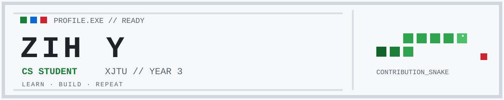

<picture>
  <source media="(prefers-color-scheme: dark)" srcset="./assets/profile-banner-dark.svg">
  <source media="(prefers-color-scheme: light)" srcset="./assets/profile-banner-light.svg">
  
</picture>

  <strong>西安交通大学 · 计算机专业 · 大三</strong> 
  正在学习，也在做一些 AI 与 Web 项目。

## `> ABOUT`

你好，我是 yzh-01。目前主要使用 Python 和 TypeScript，关注 AI 应用与全栈开发。

[WINTEROMEN 数字花园 →](https://yzh-01.github.io/)

## `> PROJECTS`

- [NutriMind-Agent](https://github.com/yzh-01/NutriMind-Agent) — AI 营养分析应用
- [Novel2Script-AI](https://github.com/yzh-01/Novel2Script-AI) — 小说转结构化剧本工具 · [Demo](https://novel2-script-ai.vercel.app/)
- [WINTEROMEN](https://github.com/yzh-01/yzh-01.github.io) — 个人数字花园

## `> STACK`

`Python` · `TypeScript` · `FastAPI` · `React` · `Next.js` · `PostgreSQL`

## `> CONTRIBUTIONS`

<picture>
  <source media="(prefers-color-scheme: dark)" srcset="https://raw.githubusercontent.com/yzh-01/yzh-01/output/github-snake-dark.svg">
  <source media="(prefers-color-scheme: light)" srcset="https://raw.githubusercontent.com/yzh-01/yzh-01/output/github-snake.svg">
  
</picture>

INSERT COIN · KEEP BUILDING
